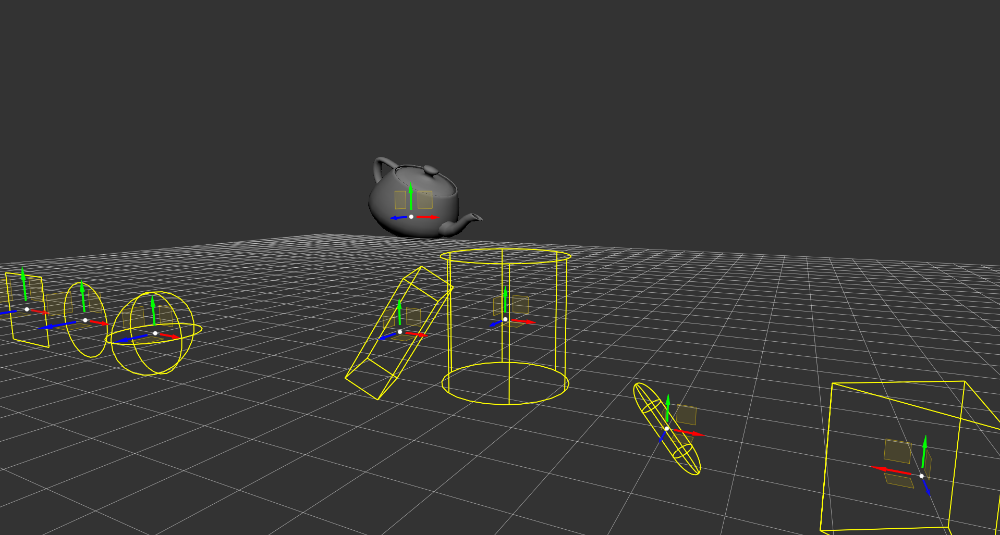

# Im3d for Jai
[Im3d](https://github.com/john-chapman/im3d) bindings for the [Jai](https://youtu.be/TH9VCN6UkyQ) programming language.

## Disclaimer
**The Jai programming language is still in closed beta as of December 27 2020.**

The library currently uses a **dll**, which is not necessarily the best choice so we'll eventually change it to link statically if possible. 

## Supported platforms
Currently, only Windows is supported.

## Dependencies
This library is currently dependant on my [linear algebra module](https://github.com/ostef/jai-modules) for `Vec2` and `Vec4` as well as the `Basic` an `Math` modules provided with the Jai compiler.

## Naming
We try to make using the library in Jai as close as possible to using it in C++:
* Jai supports function overloading as well as default parameters, so we use both when **Im3d** does.
* Until better namespacing gets added to the language, we prefix `Im3d::` functions and structs with `Im3d_` and member functions with their enclosing struct name separated by a `_`. This is done so that we can have struct definitions in `module.jai`, which is platform independant, and bindings in `windows.jai`.
* Jai does not have references, so procedures that expect a `const &` parameter are wrapped by a by-value parameter version so that using the API in Jai feels close to using it in C++. Non-const references in C++ translate to pointers in Jai and remain unchanged. When a reference (const or non-const) is returned by **Im3d**, we return a pointer.

## License
We use the same license as **Im3d** which is the **MIT License**.
